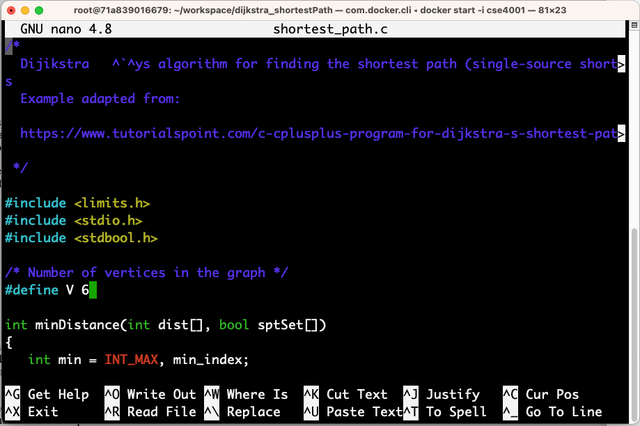
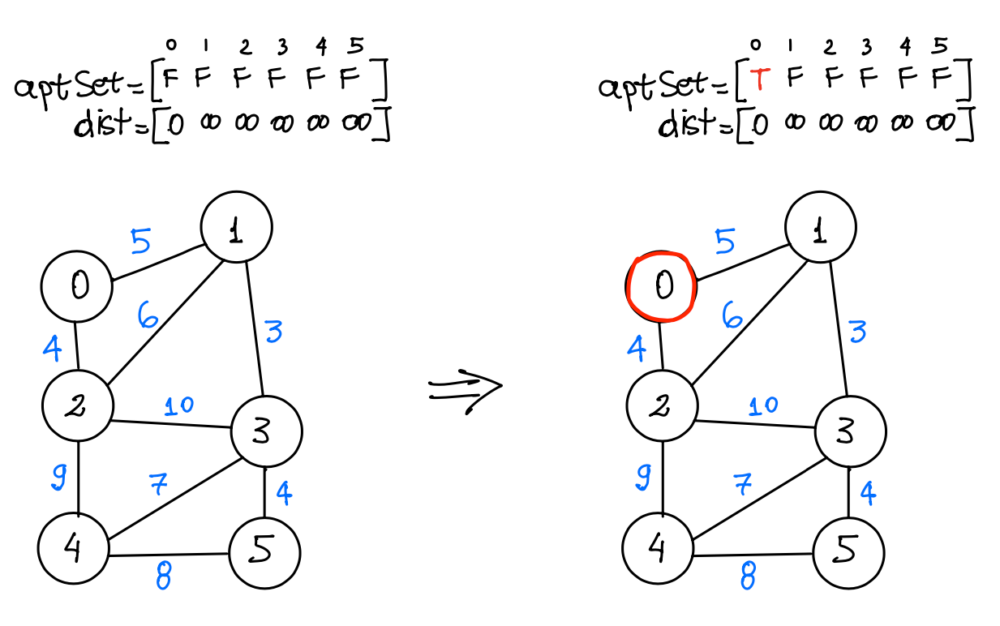
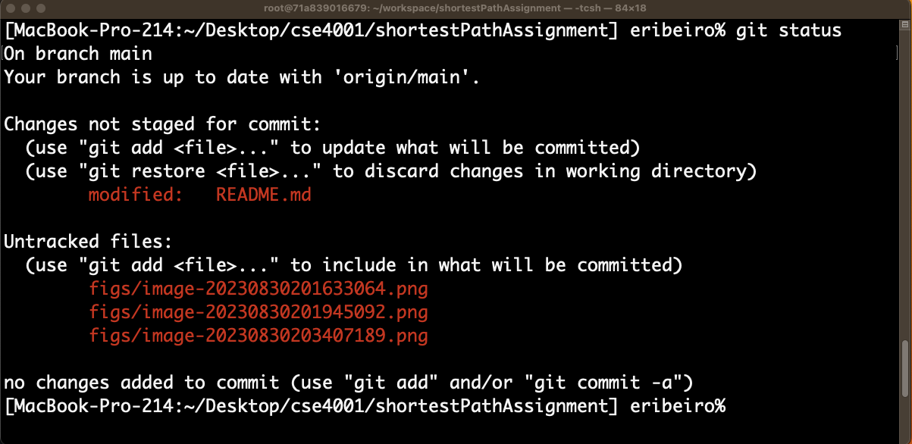
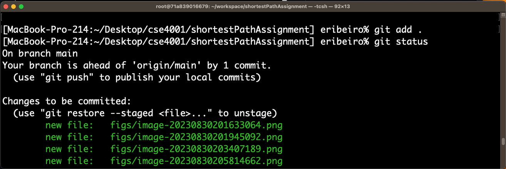
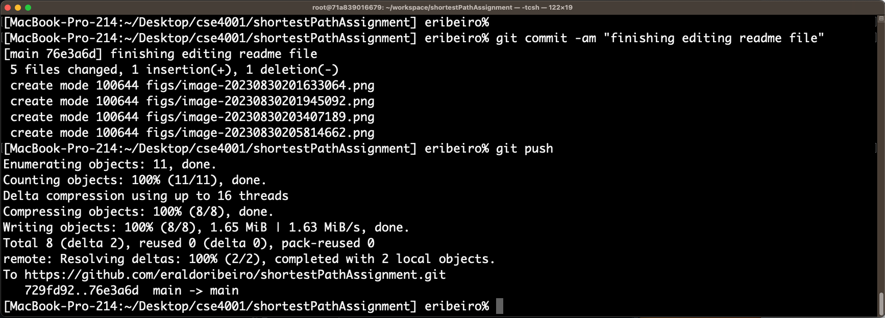
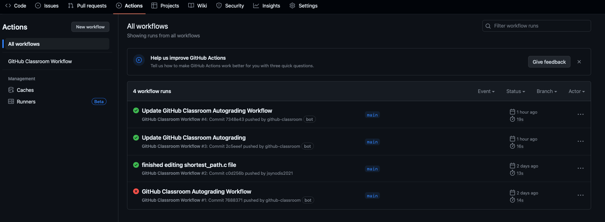

# Displaying the shortest paths of the Dijkstra’s algorithm

## Overview

In this assignment, you will modify the code of the Dijkstra’s single-source shortest-distance algorithm so that, in addition to printing the shortest-path distances, it will also print the shortest paths as a “list” of nodes. You will also need to change the formatting of the output of the program (described next).  

**Write your own code. Do not copy a solution from the Web or from anyone else**. You must study the starter code and modify it to obtain the expected output. You must not copy parts of solutions from the Web or any other source. At this point of your degree, you have already taken the courses `CSE1001`, `CSE1002`, and `CSE2010`, as well as other programming courses. Therefore, you should be able to understand the starter code and modify it on your own with little help from colleagues or any other source, except for clarifying C-Language questions such as “how to format printed output in C”, “how to align text/numerical output in C ”, and similar questions that are not related to obtaining the code that formats the output as asked in this assignment.   

## Starter code

The starter code for this assignment prints the distances from the source node to a given node but it does not show the paths. The starter code is the program: 

- [shortest_path.c](https://github.com/eraldoribeiro/shortestPathAssignment/blob/main/shortest_path.c)

The current output of this program is: 

```shell
Vertex Distance from Source
0 	 0
1 	 5
2 	 4
3 	 8
4 	 13
5 	 12
```

## Expected output format of modified program

To complete the assignment, you will modify the starter code so it produces the formatted output as shown in the the following box. 


```
 ============================================
|           Dijkstra’s algorithm             |
|        (single-source shortest path)       |
|                                            |
|              Source vertex = 0             |
 --------------------------------------------
| Vertex | Distance | Path                   |
 --------------------------------------------
|      0 |        0 | 0 <- 0                 |
|      1 |        5 | 1 <- 0                 |
|      2 |        4 | 2 <- 0                 |
|      3 |        8 | 3 <- 1 <- 0            |
|      4 |       13 | 4 <- 2 <- 0            |
|      5 |       12 | 5 <- 3 <- 1 <- 0       |
 --------------------------------------------
```

## Getting the assignment repository and starter code

**Work (mostly) on your docker Linux and not on your host computer**. The following steps assume that you will be running commands from inside your docker container Linux (and not from your host OS). While you can copy and paste URLs (e.g., repository names) and some other information onto the container Linux terminal, I recommend that you <u>do most programming and editing tasks</u> on the Linux terminal (inside the container). 

**The source code for this assignment is available from GitHub**. To get the code, you will `clone` the assignment’s repository. The cloning step will create a (local) copy of the assignment repository on your computer. Once you have your local copy of the assignment repository, you will edit the program [shortest_path.c](https://github.com/eraldoribeiro/shortestPathAssignment/blob/main/shortest_path.c) so it  produces the expected formatted output. 

**Building and testing the program**. Building and testing the program is easy as the repository comes with a `makefile` and a test script (i.e., `test.sh`). The makefile will help you build and also test the program to see if it pass the basic tests. Note that you do not need to call the test script directly. To test your program, you just need to call `make test` as follows: 


`make test` compiles the program and run the test script for you. This test script tests two basic cases. The first test case is always a pass for this assignment as it tests the return value of the program’s main function. This return value is currently hardcoded into [shortest_path.c](https://github.com/eraldoribeiro/shortestPathAssignment/blob/main/shortest_path.c) so this test will always pass. The second test case tests the output of the program, and this case currently fails because the output is different from the expected formatted output. This is the issue you need to fix to complete this assignment. 

**Editing files to complete the assignment.** While you are free to use any text editor to edit programs, I suggest that you try to edit programs directly on the docker container. A very good reason to edit files directly inside the docker container instead editing in the host computer is that docker sometimes fail to synchronizes changes in files made in the host-computer’s shared folder (https://medium.com/@jonsbun/why-need-to-be-careful-when-mounting-single-files-into-a-docker-container-4f929340834). 

One easy-to-use terminal-based editor is called `nano`. To use `nano`, type `nano <name of the program>` on the command line. See example below: 

 

The following figure shows `nano`’s user interface. 



## Understanding the program

Well, if you have take my CSE2010 course, you probably know this algorithm in details both graphically and its main steps. You have also already completed similar programming assignments coding or modifying the Prim’s algorithm and the Dijkstra algorithm. If you are not familiar with the algorithm then study some of the great online tutorials on YouTube. 

Once you learn about the Dijkstra algorithm, one of the best way to understand what the starter code does is by drawing the graph by hand and stepping through the code as you change the values and redraw the diagrams. The following figure shows an example of what (I think) the initial loops of the algorithm do. 



If you draw the result of each step of the code, and keep track of the values that are calculated, you should be able to see what you need to change in the code to keep track of the nodes forming the path of each shortest distance. **Hint**: Should we store the predecessor node to a given node for which the shortest distance has been modified? 

## Submitting the assignment

To submit the assignment, you will `git commit` and `git push` the repository to the GitHub server. If you add new files, you will also need to `git add` to add the new files to the source control records. As you work on your assignment on the local folder, you can check the status of git by typing `git status`. The following figure shows an example of running `git status` to check the current state of a local repository. 



The following screenshot shows the use of `git add .` to add the new files that were not under source control, followed by another `git status` check. 



The following screenshot shows the use of `git commit` followed by `git push`, which will send the updated files to the repository on GitHub server. 



Once you submit your assignment (i.e., `git push`), you should open the repository URL, refresh it, and check if the changes you made are reflected on the files on the GitHub server. <u>If the changes are not there then you have not submitted the assignment</u>. 

## Automated testing from GitHub

In addition to testing your program using `make test`, you can also see check the results of the automated testing action done by GitHub. GitHub will run the tests (i.e., `make test`) automatically every time you push new code to the GitHub repository. To see the results of the tests and see if your program pass or fail the tests, go to the Action tab. There, all commits/pushes will be listed along with the result of the automated tests (i.e., Green checkmark means a PASS while a red cross means Fail). See screenshot below for an example. 



## For Windows users 

When working on assignments for CSE4001, try to work mostly on the Linux CSE4001 container. I know this means working on the command-line interface using the bash shell, and that can be slow to many of you for a bit. But, working from inside the container will help you learn how to use Linux and will also reduce the changes of files being corrupted by Windows. Windows may adds hidden characters to text files and might have some compatibility issues with Linux. 

**The `\r' flag**. If you already cloned repository files or created files in Windows, and you are having problems running or opening the files in Linux then maybe the tool dos2unix can help you "convert" the files between the two OS. The following page explains the issue and suggests the use of dos2unix and unix2dos: https://www.geeksforgeeks.org/dos2unix-unix2dos-commands/

Again, the best approach for you as a student (with an goal of learning Unix) is to work mostly from inside the Linux container even for editing files (e.g., use the nano text editor). Of course, browsing the web and other GUI-based tasks are better done on your host OS since it has a GUI. 


